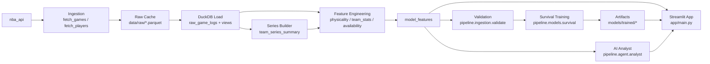

# NBA Playoff Predictor

End-to-end system for ingesting NBA data, engineering playoff-specific features, training a survival model, and exposing outputs in a Streamlit app with an AI analyst layer.

## What This Repo Contains

- Data engineering pipeline (`pipeline/ingestion`) that pulls and validates team/player/game data.
- Feature engineering modules (`pipeline/features`) that build model-ready tables in DuckDB.
- Modeling modules (`pipeline/models`) for survival training + evaluation.
- App layer (`app`) for interactive UI and AI analyst chat.
- Local analytical warehouse (`data/processed/nba.duckdb`) as the system of record.

## Current End-to-End Flow

1. Fetch and cache raw data to parquet in `data/raw/`.
2. Load cached games into DuckDB (`raw_game_logs`, `regular_season`, `playoffs`).
3. Build `team_series_summary` from playoff game IDs.
4. Build feature tables (`physicality_features`, `team_stats_features`, `availability_features`).
5. Join to `model_features`.
6. Validate table completeness and season coverage.
7. Train/evaluate survival model and save artifacts.
8. Serve outputs in Streamlit app.



## Fast Start

```bash
# Setup
uv venv
source .venv/bin/activate
uv sync

# Build from existing caches + validate
python -m pipeline.run_pipeline --skip-fetch

# Optional: include model training
python -m pipeline.run_pipeline --skip-fetch --with-model

# Run app
streamlit run app/main.py
```

## Documentation Map

- Pipeline overview: [pipeline/README.md](/Users/nick/Downloads/nba_playoff_predictor/pipeline/README.md)
- Ingestion details: [pipeline/ingestion/README.md](/Users/nick/Downloads/nba_playoff_predictor/pipeline/ingestion/README.md)
- Feature engineering: [pipeline/features/README.md](/Users/nick/Downloads/nba_playoff_predictor/pipeline/features/README.md)
- Modeling: [pipeline/models/README.md](/Users/nick/Downloads/nba_playoff_predictor/pipeline/models/README.md)
- Agent layer: [pipeline/agent/README.md](/Users/nick/Downloads/nba_playoff_predictor/pipeline/agent/README.md)
- App layer: [app/README.md](/Users/nick/Downloads/nba_playoff_predictor/app/README.md)
- Trained artifacts: [models/README.md](/Users/nick/Downloads/nba_playoff_predictor/models/README.md)

## Key Tables

Core ingestion tables/views:
- `raw_game_logs`
- `regular_season` (view)
- `playoffs` (view)
- `raw_player_logs_rs`
- `raw_player_logs_po`
- `team_series_summary`

Feature/model tables:
- `physicality_features`
- `team_stats_features`
- `availability_features`
- `game_availability`
- `model_features`
- `survival_validation_predictions`
- `current_season_predictions`
- `current_feature_snapshot`
- `projected_playoff_field`
- `projected_first_round_matchups`
- `play_in_simulation_results`
- `simulation_team_odds_current`
- `series_predictions_current`

App-ready tables:
- `app_title_odds_current`
- `app_series_predictions_current`
- `app_playoff_field_current`
- `app_play_in_current`

## Health Checks

Run the validator any time you refresh data:

```bash
python -m pipeline.ingestion.validate
```

Strict mode (warnings fail build):

```bash
python -m pipeline.ingestion.validate --strict
```
