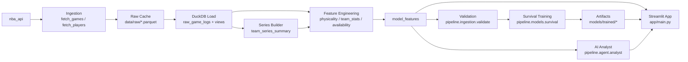

# NBA Playoff Predictor

**[Live App](https://nhx87-nba-playoff-predictor-app-main.streamlit.app)** &nbsp;|&nbsp; **[Portfolio Site](https://nhx87.github.io/nba-playoff-predictor-site/)**

End-to-end system for ingesting NBA data, engineering playoff-specific features, training a survival model, and exposing outputs in a Streamlit app with an AI analyst layer.

## What This Repo Contains

- Data engineering pipeline (`pipeline/ingestion`) that pulls and validates team/player/game data.
- Feature engineering modules (`pipeline/features`) that build model-ready tables in DuckDB.
- Modeling modules (`pipeline/models`) for survival training + evaluation.
- App layer (`app`) for interactive UI and AI analyst chat.
- Portfolio layer (`portfolio`) for a public-facing project case-study website.
- Local analytical warehouse (`data/processed/nba.duckdb`) as the system of record.

## Current End-to-End Flow

1. Fetch and cache raw data to parquet in `data/raw/`.
2. Load cached games into DuckDB (`raw_game_logs`, `regular_season`, `playoffs`).
3. Build `team_series_summary` from playoff game IDs.
4. Build feature tables (`physicality_features`, `team_stats_features`, `availability_features`).
5. Join to `model_features`.
6. Validate table completeness and season coverage.
7. Train/evaluate survival model and save artifacts.
8. Serve outputs in Streamlit app.



## Fast Start

```bash
# Setup
uv venv
source .venv/bin/activate
uv sync

# Build from existing caches + validate
python -m pipeline.run_pipeline --skip-fetch

# Optional: include model training
python -m pipeline.run_pipeline --skip-fetch --with-model

# Run app
streamlit run app/main.py

# Run portfolio site
python -m http.server
# open http://localhost:8000/portfolio/index.html
```

## Documentation Map

- Pipeline overview: [pipeline/README.md](/Users/nick/Downloads/nba_playoff_predictor/pipeline/README.md)
- Ingestion details: [pipeline/ingestion/README.md](/Users/nick/Downloads/nba_playoff_predictor/pipeline/ingestion/README.md)
- Feature engineering: [pipeline/features/README.md](/Users/nick/Downloads/nba_playoff_predictor/pipeline/features/README.md)
- Modeling: [pipeline/models/README.md](/Users/nick/Downloads/nba_playoff_predictor/pipeline/models/README.md)
- Agent layer: [pipeline/agent/README.md](/Users/nick/Downloads/nba_playoff_predictor/pipeline/agent/README.md)
- App layer: [app/README.md](/Users/nick/Downloads/nba_playoff_predictor/app/README.md)
- UX contract: [docs/UX_SPEC.md](/Users/nick/Downloads/nba_playoff_predictor/docs/UX_SPEC.md)
- Portfolio site: [portfolio/README.md](/Users/nick/Downloads/nba_playoff_predictor/portfolio/README.md)
- Trained artifacts: [models/README.md](/Users/nick/Downloads/nba_playoff_predictor/models/README.md)

## Key Tables

Core ingestion tables/views:
- `raw_game_logs`
- `regular_season` (view)
- `playoffs` (view)
- `raw_player_logs_rs`
- `raw_player_logs_po`
- `team_series_summary`

Feature/model tables:
- `physicality_features`
- `team_stats_features`
- `availability_features`
- `game_availability`
- `model_features`
- `survival_validation_predictions`
- `current_season_predictions`
- `current_feature_snapshot`
- `projected_playoff_field`
- `projected_first_round_matchups`
- `play_in_simulation_results`
- `simulation_team_odds_current`
- `series_predictions_current`

App-ready tables:
- `app_title_odds_current`
- `app_series_predictions_current`
- `app_playoff_field_current`
- `app_play_in_current`

Evaluation tables:
- `loyo_season_summary`
- `loyo_series_predictions`

## Model Coefficients

### Survival Model (CoxPH)

Negative coefficient = lower elimination hazard = goes deeper in playoffs.
Trained on 192 team-seasons (2010-11 → 2021-22), 5 RS-only features.

| Feature | Coefficient | Interpretation |
| --- | --- | --- |
| `rs_efg_pct` | −5.283 | Strongest signal — efficient shooting teams survive longer |
| `rs_close_game_win_pct` | −1.741 | Clutch performance under pressure |
| `rs_vs_top_teams_win_pct` | −1.633 | Proven against elite competition |
| `rs_net_rating` | −0.189 | Overall point differential |
| `rs_fta` | +0.043 | Higher foul-drawing slightly increases elimination risk |

### Matchup Model (Logistic Regression)

Coefficient on delta features (team_a − team_b). Positive = team_a advantage increases win probability.
Trained on 360 symmetric series rows (12 seasons × 15 series × 2).

| Feature (delta) | Coefficient | Interpretation |
| --- | --- | --- |
| `delta_rs_net_rating` | +0.867 | Strongest matchup signal — point differential edge |
| `delta_rs_efg_pct` | +0.539 | Shooting efficiency advantage |
| `delta_rs_vs_top_teams_win_pct` | +0.469 | Strength-of-schedule edge |
| `delta_rs_close_game_win_pct` | +0.297 | Clutch game edge |
| `delta_rs_fta` | −0.275 | Higher FTA team faces slightly worse odds |

## Model Accuracy — LOYO Backtest

Leave-one-year-out cross-validation across all 15 seasons (2010-11 → 2024-25).
Each fold trains on 14 seasons and evaluates on the 1 held-out season.
225 total series evaluated. Full results: [`models/trained/loyo_backtest_results.json`](models/trained/loyo_backtest_results.json)

### Survival Model (CoxPH) — playoff depth ranking

| Metric | Value |
| --- | --- |
| Mean C-index | 0.796 ±0.074 |
| C-index range | 0.635 – 0.906 |
| Champion predicted #1 | 46.7% (7/15 seasons) |
| Champion in top 3 | 80.0% (12/15 seasons) |
| Champion in top 5 | 100% (15/15 seasons) |
| Mean champion rank | 2.3 / 16 |

### Matchup Model (Logistic Regression) — series winner prediction

| Metric | Value |
| --- | --- |
| Overall series accuracy | 72.9% (225 series) |
| ROC-AUC | 0.802 |
| Mean Brier score | 0.183 (random baseline = 0.25) |

| Round | Accuracy | n |
| --- | --- | --- |
| First Round | 76.7% | 120 |
| Conference Semifinals | 65.0% | 60 |
| Conference Finals | 70.0% | 30 |
| NBA Finals | 80.0% | 15 |

Run the backtest:

```bash
python -m pipeline.models.loyo_backtest
```

## Health Checks

Run the validator any time you refresh data:

```bash
python -m pipeline.ingestion.validate
```

Strict mode (warnings fail build):

```bash
python -m pipeline.ingestion.validate --strict
```
